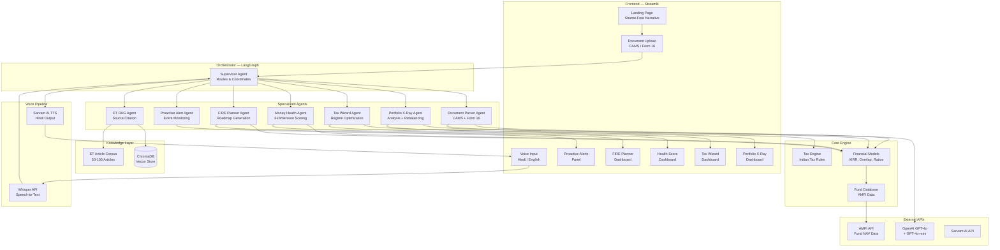

# MoneyMentor AI — "CFO for Every Indian" — Implementation Plan

> **Hackathon:** ET AI Hackathon 2026 | **Problem Statement:** #9 — AI Money Mentor
> **Positioning:** India's first proactive financial CFO — powered by ET's 25 years of intelligence

## System Architecture



---

## Project Structure

```
D:\ET\
├── app.py                          # Streamlit entry point
├── requirements.txt                # All dependencies
├── .env.example                    # Environment variable template
├── README.md                       # Setup instructions + hackathon submission
│
├── config/
│   ├── __init__.py
│   └── settings.py                 # Centralized config (API keys, model names, paths)
│
├── agents/
│   ├── __init__.py
│   ├── orchestrator.py             # LangGraph supervisor agent
│   ├── document_parser.py          # CAMS/Form16 parsing agent
│   ├── portfolio_xray.py           # Portfolio analysis agent
│   ├── tax_wizard.py               # Tax optimization agent
│   ├── health_scorer.py            # Money health scoring agent
│   ├── fire_planner.py             # FIRE roadmap agent
│   ├── alert_agent.py              # Proactive alert agent
│   └── et_rag_agent.py             # ET knowledge RAG agent
│
├── core/
│   ├── __init__.py
│   ├── schemas.py                  # Pydantic data models
│   ├── financial_models.py         # XIRR, overlap, expense ratio, benchmarking
│   ├── tax_engine.py               # Indian tax rules (Old/New regime, deductions)
│   └── fund_data.py                # AMFI fund data fetching + caching
│
├── rag/
│   ├── __init__.py
│   ├── indexer.py                  # ET corpus → ChromaDB vector index
│   ├── retriever.py                # Semantic search + citation formatting
│   └── corpus/                     # Curated ET articles (markdown files)
│       ├── mutual_funds_guide.md
│       ├── budget_2025_analysis.md
│       ├── nps_strategy.md
│       ├── tax_saving_investments.md
│       └── ... (50-100 articles)
│
├── voice/
│   ├── __init__.py
│   ├── stt.py                      # Whisper API speech-to-text
│   ├── tts.py                      # Sarvam AI / Google TTS
│   └── personas.py                 # Language + literacy level calibration
│
├── ui/
│   ├── __init__.py
│   ├── styles.py                   # Custom CSS (dark theme, glassmorphism)
│   ├── components.py               # Reusable Streamlit components
│   ├── landing_page.py             # Shame-free narrative + onboarding
│   ├── portfolio_dashboard.py      # X-Ray visualizations
│   ├── tax_dashboard.py            # Tax comparison + deductions
│   ├── health_dashboard.py         # 6-dimension radar chart
│   ├── fire_dashboard.py           # FIRE roadmap timeline
│   └── alerts_panel.py             # Proactive alerts UI
│
├── data/
│   ├── sample_cams.pdf             # Sample CAMS statement for demo
│   ├── sample_form16.pdf           # Sample Form 16 for demo
│   ├── fund_database.json          # Cached AMFI fund metadata
│   ├── tax_rules.json              # Indian tax rules knowledge base
│   ├── policy_events.json          # Simulated policy events for proactive alerts
│   └── fund_holdings.json          # Top fund holdings for overlap detection
│
├── tests/
│   ├── test_financial_models.py    # Unit tests for XIRR, overlap, etc.
│   ├── test_tax_engine.py          # Unit tests for tax calculations
│   └── test_agents.py              # Integration tests for agent workflows
│
└── docs/
    ├── architecture.md             # 1-2 page architecture document (submission)
    └── impact_model.md             # Business impact model (submission)
```

---

## Proposed Changes — Phase by Phase

---

### Phase 1: Foundation & Core Engine

The mathematical backbone — all financial calculations, tax rules, and data models.

#### [NEW] [requirements.txt](file:///D:/ET/requirements.txt)
```
streamlit>=1.30.0
openai>=1.10.0
langchain>=0.1.0
langgraph>=0.0.40
chromadb>=0.4.0
pdfplumber>=0.10.0
plotly>=5.18.0
pandas>=2.1.0
numpy>=1.26.0
pydantic>=2.5.0
python-dotenv>=1.0.0
scipy>=1.12.0
requests>=2.31.0
Pillow>=10.0.0
```

#### [NEW] [settings.py](file:///D:/ET/config/settings.py)
- Centralized config: API keys from env vars, model selection (GPT-4o / GPT-4o-mini), file paths, feature flags
- Model config: temperature, max tokens, system prompts per agent
- Voice config: language options, persona levels

#### [NEW] [schemas.py](file:///D:/ET/core/schemas.py)
Pydantic models for all data flowing through the system:
- `MutualFundHolding` — scheme name, folio, units, NAV, current value, ISIN
- `PortfolioData` — list of holdings, total value, investment date ranges
- `PortfolioXRay` — XIRR, overlap matrix, expense ratios, benchmark comparison, rebalancing plan
- `TaxProfile` — income components, deductions claimed, regime comparison
- `TaxOptimization` — missed deductions, savings amount, recommended investments
- `HealthScore` — scores across 6 dimensions + overall score + improvement actions
- `FIREPlan` — target age, monthly SIP amounts, asset allocation timeline, milestones
- `ProactiveAlert` — event type, impact description, personalized action, urgency level
- `ETArticleCitation` — article title, URL, relevant excerpt, relevance score

#### [NEW] [financial_models.py](file:///D:/ET/core/financial_models.py)
Core financial calculation functions:
- `calculate_xirr(cashflows)` — Extended Internal Rate of Return using Newton's method (scipy)
- `detect_fund_overlap(holdings)` — Compare top-10 holdings across funds, return overlap % matrix
- `calculate_expense_ratio_drag(holdings)` — Annual cost in ₹ from expense ratios vs direct plans
- `benchmark_comparison(holdings, benchmark="NIFTY50")` — Compare returns vs benchmark
- `generate_rebalancing_plan(holdings, target_allocation)` — Buy/sell recommendations
- `calculate_portfolio_beta(holdings)` — Risk metric
- `calculate_sharpe_ratio(holdings)` — Risk-adjusted returns

#### [NEW] [tax_engine.py](file:///D:/ET/core/tax_engine.py)
Complete Indian tax calculation engine:
- `compare_tax_regimes(income_data)` — Old vs New regime with exact ₹ difference
- `find_missed_deductions(profile)` — Scan for unclaimed 80C, 80CCD(1B), 80D, 80E, 80G, HRA, LTA
- `calculate_hra_exemption(salary, rent, city)` — HRA calculation with metro/non-metro rules
- `calculate_nps_benefit(contribution)` — Additional ₹50K under 80CCD(1B)
- `rank_tax_saving_investments(risk_profile, liquidity_need)` — ELSS vs PPF vs NPS vs FD vs SCSS
- Tax slab data for FY 2024-25 and FY 2025-26 (both regimes)

#### [NEW] [fund_data.py](file:///D:/ET/core/fund_data.py)
- Fetch latest NAV data from AMFI API (`https://www.amfiindia.com/spages/NAVAll.txt`)
- Cache fund metadata: scheme name, category, expense ratio, benchmark index
- Map ISIN to fund details
- Holdings data for top 200 funds (for overlap detection)

---

### Phase 2: Document Intelligence

Parse real financial documents into structured data.

#### [NEW] [document_parser.py](file:///D:/ET/agents/document_parser.py)
Two parsing pipelines:

**CAMS/KFintech Parser:**
1. Extract text with `pdfplumber` first (cheaper, faster)
2. If structured extraction fails → fall back to GPT-4o vision (upload PDF pages as images)
3. LLM extracts: scheme names, folio numbers, units, purchase dates, amounts, current value
4. Output: `PortfolioData` schema

**Form 16 Parser:**
1. Same dual approach: pdfplumber → GPT-4o vision fallback
2. Extract: gross salary, HRA, LTA, standard deduction, 80C/80D deductions, TDS
3. Output: `TaxProfile` schema

Both parsers include validation — cross-check totals, flag missing data, handle edge cases (multiple employers, part-year employment).

---

### Phase 3: AI Agents (The Brain)

Each agent is a specialized LangChain agent with defined tools and prompts.

#### [NEW] [portfolio_xray.py](file:///D:/ET/agents/portfolio_xray.py)
- **Input:** `PortfolioData` from document parser
- **Tools:** `calculate_xirr`, `detect_fund_overlap`, `calculate_expense_ratio_drag`, `benchmark_comparison`
- **Process:**
  1. Calculate true XIRR for each fund and overall portfolio
  2. Run overlap detection across all fund holdings
  3. Calculate expense ratio drag in ₹
  4. Compare vs NIFTY 50 / category benchmark
  5. Generate rebalancing recommendations
- **Output:** `PortfolioXRay` + plain-language summary (calibrated to user's literacy level)
- **ET RAG Integration:** Cite relevant ET articles for each recommendation

#### [NEW] [tax_wizard.py](file:///D:/ET/agents/tax_wizard.py)
- **Input:** `TaxProfile` from Form 16 parser
- **Tools:** `compare_tax_regimes`, `find_missed_deductions`, `rank_tax_saving_investments`
- **Process:**
  1. Calculate tax under both regimes with user's exact numbers
  2. Identify every missed deduction with ₹ impact
  3. Recommend tax-saving investments ranked by risk profile
  4. Generate deadline-aware action plan (e.g., "invest ₹1.5L in ELSS before March 31")
- **Output:** `TaxOptimization` + comparison table + action items

#### [NEW] [health_scorer.py](file:///D:/ET/agents/health_scorer.py)
- **Input:** User's financial profile (from documents + conversational intake)
- **6 Dimensions scored 0-100:**
  1. Emergency Preparedness — months of expenses covered
  2. Insurance Coverage — life + health coverage adequacy
  3. Investment Diversification — asset class spread
  4. Debt Health — debt-to-income ratio, interest rates
  5. Tax Efficiency — % of eligible deductions claimed
  6. Retirement Readiness — projected corpus vs required corpus
- **Output:** `HealthScore` with radar chart data + top 3 improvement actions

#### [NEW] [fire_planner.py](file:///D:/ET/agents/fire_planner.py)
- **Input:** Age, income, expenses, goals, existing investments, risk appetite
- **Process (LLM + financial models):**
  1. Calculate required retirement corpus (inflation-adjusted, 4% withdrawal rule)
  2. Model SIP amounts per goal (retirement, house, education, emergency)
  3. Design asset allocation glide path (equity-heavy young → debt-heavy near retirement)
  4. Project month-by-month portfolio growth with Monte Carlo scenarios
  5. Identify insurance and emergency fund gaps
- **Output:** `FIREPlan` with timeline chart data + monthly action plan

#### [NEW] [alert_agent.py](file:///D:/ET/agents/alert_agent.py)
- **Proactive intelligence:** Monitors policy/market events and personalizes impact
- **For hackathon MVP — simulated event loop:**
  - Pre-loaded events in `policy_events.json`:
    - RBI repo rate change → EMI impact calculation
    - Budget 2025 NPS rule change → projected savings
    - SEBI MF reclassification → affected funds in user's portfolio
    - Market correction event → portfolio risk threshold breach
  - When user's portfolio is loaded, agent scans events and generates personalized alerts
- **Output:** List of `ProactiveAlert` with urgency, ₹ impact, and action steps

#### [NEW] [et_rag_agent.py](file:///D:/ET/agents/et_rag_agent.py)
- **Purpose:** Every recommendation cites ET articles as proof
- **Process:**
  1. Takes a recommendation (e.g., "rebalance large-cap allocation")
  2. Searches ChromaDB for relevant ET articles
  3. Returns top 2-3 citations with title, excerpt, and link
- **Output:** `ETArticleCitation` list attached to each agent's output

#### [NEW] [orchestrator.py](file:///D:/ET/agents/orchestrator.py)
LangGraph-based multi-agent supervisor:
- **State graph** with nodes: `document_parsing` → `analysis` → `recommendations` → `citations`
- **Routing logic:** Based on uploaded document type (CAMS → portfolio path, Form 16 → tax path, both → full analysis)
- **Parallel execution:** Portfolio X-Ray and Tax Wizard can run in parallel
- **Sequential dependencies:** Health Score and FIRE Plan depend on earlier agent outputs
- **Error handling:** Each agent has retry logic + graceful degradation
- **Audit trail:** Every agent decision logged with reasoning

---

### Phase 4: Voice & Language

Hindi-first voice interface — the demo-winning feature.

#### [NEW] [stt.py](file:///D:/ET/voice/stt.py)
- OpenAI Whisper API integration
- Auto-detect language (Hindi / English / mixed)
- Return transcript + detected language code

#### [NEW] [tts.py](file:///D:/ET/voice/tts.py)
- Primary: Sarvam AI TTS (natural Hindi voice)
- Fallback: Google Cloud TTS
- Stream audio to Streamlit audio player

#### [NEW] [personas.py](file:///D:/ET/voice/personas.py)
- **Novice persona:** Simple Hindi, avoid jargon, use analogies ("SIP matlab har mahine thoda thoda invest karna, jaise recurring deposit")
- **Intermediate persona:** Mix Hindi-English, use financial terms with brief explanations
- **Expert persona:** Technical language, assume knowledge of markets
- Auto-detect from user's language complexity + explicit setting

---

### Phase 5: RAG & ET Knowledge Base

#### [NEW] [corpus/](file:///D:/ET/rag/corpus/)
50-100 curated markdown articles covering:
- Mutual fund strategies (large/mid/small cap, index funds, debt funds)
- Tax planning guides (80C, NPS, ELSS, HRA optimization)
- Budget 2025 analysis and implications
- Retirement planning frameworks
- Insurance guidance
- Market outlook and sector analysis

> [!NOTE]
> For the hackathon, we'll write these as representative articles capturing the style and substance of ET Prime content. They demonstrate the RAG capability — in production, this would index ET's real corpus.

#### [NEW] [indexer.py](file:///D:/ET/rag/indexer.py)
- Load markdown files from `corpus/`
- Chunk by section (heading-aware splitting)
- Generate embeddings with `text-embedding-3-small`
- Store in ChromaDB with metadata (title, category, date, source URL)

#### [NEW] [retriever.py](file:///D:/ET/rag/retriever.py)
- Semantic search over ChromaDB
- Return top-k results with relevance score
- Format citations for agent output: `"According to ET Prime: [title] — [excerpt]"`

---

### Phase 6: Premium Streamlit UI

A dark-mode, glassmorphic dashboard that feels like Bloomberg Terminal meets Cred.

#### [NEW] [styles.py](file:///D:/ET/ui/styles.py)
Custom CSS injected via `st.markdown`:
- **Color palette:** Deep navy (`#0a0e27`), electric blue (`#00d4ff`), emerald green (`#00c853`), amber alerts (`#ff9100`), white text
- **Typography:** Inter font from Google Fonts
- **Cards:** Glassmorphism effect (semi-transparent, blur backdrop, subtle borders)
- **Animations:** CSS keyframes for score counter animations, card fade-ins
- **Charts:** Plotly dark theme matching the UI palette

#### [NEW] [landing_page.py](file:///D:/ET/ui/landing_page.py)
- Shame-free narrative header: *"83% of Indians feel ashamed to talk about money..."*
- Animated statistics counter
- Two CTAs: "Upload CAMS Statement" / "Upload Form 16"
- Voice input button: "🎤 Speak in Hindi"
- Demo persona selector (for hackathon judges): "Try as Sunita — Teacher from Lucknow"

#### [NEW] [portfolio_dashboard.py](file:///D:/ET/ui/portfolio_dashboard.py)
- **Hero metric:** Overall XIRR with comparison vs NIFTY 50 (large animated number)
- **Overlap heatmap:** Plotly heatmap showing % overlap between fund pairs
- **Fund-by-fund table:** Scheme name, value, XIRR, expense ratio, benchmark delta
- **Expense ratio drag:** "You're paying ₹X/year in hidden fees" with bar chart
- **Rebalancing plan:** Action cards — "Sell Fund A, Add to Fund B" with reasoning
- **ET Citations:** Sidebar with relevant ET articles supporting each recommendation

#### [NEW] [tax_dashboard.py](file:///D:/ET/ui/tax_dashboard.py)
- **Regime comparison:** Side-by-side Old vs New regime with ₹ difference highlighted
- **Missed deductions:** Cards for each missed deduction with ₹ impact
- **Investment recommendations:** Ranked list with risk/liquidity/lock-in indicators
- **Timeline:** "Do this by March 31" deadline markers

#### [NEW] [health_dashboard.py](file:///D:/ET/ui/health_dashboard.py)
- **Radar chart:** 6-dimension Money Health Score (Plotly radar/spider chart)
- **Overall score:** Large animated counter 0-100 with color (red/yellow/green)
- **Improvement actions:** Top 3 actions with projected score improvement
- **Before/After:** "If you follow these 3 actions, score goes from 54 → 71"

#### [NEW] [fire_dashboard.py](file:///D:/ET/ui/fire_dashboard.py)
- **FIRE timeline:** Interactive Plotly chart showing projected net worth over time
- **Goal milestones:** Markers on timeline (house, child education, retirement)
- **Monthly SIP plan:** Allocation table with ₹ per goal per month
- **Asset allocation glide path:** Stacked area chart showing equity/debt/gold over time

#### [NEW] [alerts_panel.py](file:///D:/ET/ui/alerts_panel.py)
- **Alert cards:** Color-coded by urgency (red/amber/green)
- **Each alert:** Event summary → "Impact on YOUR portfolio" → Action button
- **Example alert:** "🔔 Budget 2025: NPS rules changed → You save ₹31,200 → [See Action Plan]"

#### [NEW] [app.py](file:///D:/ET/app.py)
Main Streamlit app:
- Multi-page navigation via sidebar tabs
- Session state management for user data persistence
- Loading animations during agent processing
- Error handling with user-friendly messages

---

### Phase 7: Demo & Submission Assets

#### [NEW] [architecture.md](file:///D:/ET/docs/architecture.md)
1-2 page architecture document for submission:
- System diagram (from Mermaid above)
- Agent roles and communication flow
- Tool integrations
- Error handling logic
- Tech stack summary

#### [NEW] [impact_model.md](file:///D:/ET/docs/impact_model.md)
Business impact quantification:
- **Tax savings:** Avg ₹25,000/user × 10L users = ₹2,500 crore/year recovered
- **Portfolio optimization:** 0.5% expense ratio reduction × avg ₹5L portfolio × 10L users
- **ET revenue:** Financial services cross-sell conversion model
- **User acquisition:** Monetization of financial profiles

#### [NEW] [README.md](file:///D:/ET/README.md)
Hackathon submission README:
- Problem statement
- Solution overview
- Setup instructions (one-command install)
- Demo flow walkthrough
- Architecture summary
- Impact model summary
- Team information

---

## Data Files

#### [NEW] [tax_rules.json](file:///D:/ET/data/tax_rules.json)
Complete Indian tax rules for FY 2024-25 and 2025-26:
- Old & New regime slabs
- All Section 80 deductions with limits
- HRA calculation rules
- Standard deduction amounts
- Surcharge and cess rates

#### [NEW] [policy_events.json](file:///D:/ET/data/policy_events.json)
Simulated real policy events for proactive alerts:
- RBI repo rate cut (Feb 2025) → EMI impact
- Budget 2025 NPS withdrawal rule change → tax impact
- SEBI MF re-categorization → affected funds
- Market correction >5% → risk threshold alert

#### [NEW] [fund_holdings.json](file:///D:/ET/data/fund_holdings.json)
Top holdings for 200+ popular mutual funds (for overlap detection). Sourced from public fund factsheets.

#### [NEW] [fund_database.json](file:///D:/ET/data/fund_database.json)
Cached fund metadata: scheme codes, names, categories, expense ratios, benchmarks.

---

## Verification Plan

### Automated Tests

```bash
# Run all unit tests
cd D:\ET
python -m pytest tests/ -v

# Test financial calculations specifically
python -m pytest tests/test_financial_models.py -v

# Test tax engine
python -m pytest tests/test_tax_engine.py -v
```

**`test_financial_models.py`** will verify:
- XIRR calculation against known values (manual cross-check with Excel XIRR)
- Overlap detection with synthetic fund data (known overlapping holdings)
- Expense ratio drag calculation accuracy
- Edge cases: single fund, zero investment, negative returns

**`test_tax_engine.py`** will verify:
- Old vs New regime calculation with known salary slabs
- Missed deduction detection with synthetic profiles
- HRA exemption calculation (metro vs non-metro)
- NPS benefit calculation
- Edge cases: zero income, max bracket, multiple employer Form 16

### Browser / UI Testing

```bash
# Launch Streamlit app
cd D:\ET
streamlit run app.py
```

Manual verification flow (walk through in browser):
1. **Landing page** loads with shame-free narrative, upload buttons, voice button
2. **Upload sample CAMS PDF** → parsing indicator → Portfolio X-Ray dashboard appears
3. **Verify X-Ray data:** XIRR values, overlap heatmap, expense ratio drag, rebalancing plan
4. **Upload sample Form 16** → Tax Wizard dashboard appears
5. **Verify Tax Wizard:** Old vs New regime comparison, missed deductions listed, investment recommendations
6. **Take Health Score quiz** → 6-dimension radar chart appears with score
7. **Generate FIRE plan** → timeline chart with milestones appears
8. **Check Proactive Alerts** → alert cards fire based on loaded portfolio
9. **Test Hindi voice** → speak or play pre-recorded Hindi audio → response in Hindi
10. **Verify ET citations** → each recommendation includes ET article reference

### End-to-End Demo Test

Run the complete demo flow in sequence to ensure all agents work together:
```bash
# Run the demo flow script (simulates the 3-minute pitch)
cd D:\ET
python -m tests.test_demo_flow
```

This script will:
1. Load sample CAMS PDF → verify `PortfolioData` schema
2. Run Portfolio X-Ray agent → verify `PortfolioXRay` output
3. Load sample Form 16 → verify `TaxProfile` schema
4. Run Tax Wizard → verify `TaxOptimization` output
5. Run Health Scorer → verify score dimensions
6. Run FIRE Planner → verify roadmap generation
7. Run Alert Agent → verify personalized alerts fire
8. Run ET RAG → verify citations are attached
9. Print all outputs for manual review
